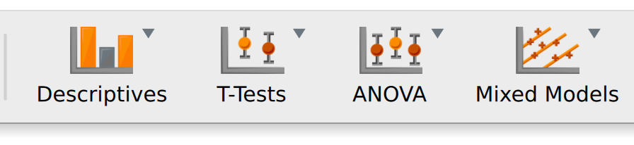
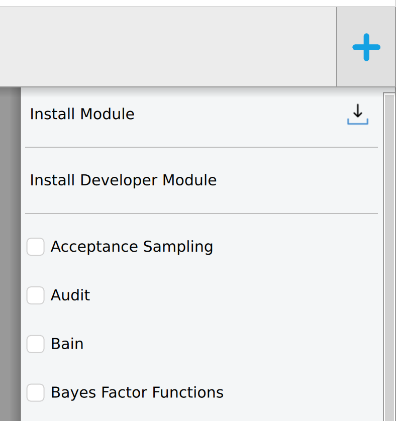
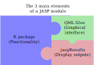

# Welcome & Overview {#sec-welcome}

This guide covers everything you need to know to develop a JASP module — from setting up your environment to publishing in the JASP Module Library.

## What is a JASP module?

A JASP module is an extension that adds new statistical analyses to JASP. Modules appear in the ribbon bar at the top of JASP and can be installed via the `+` icon.





Internally, a JASP module is an **R package** with additional QML files for the graphical interface:

{width="400"}

-   **R code** — your statistical computations, using any CRAN/Bioconductor packages
-   **QML interface** — the options panel users interact with
-   **jaspResults** — the bridge that renders tables, plots, and text in JASP's output

## Who is this guide for?

Anyone who wants to create or contribute to JASP modules. You need:

-   **Basic R** — functions, data manipulation, `data.frame` operations
-   **Basic Git/GitHub** — clone, commit, push, pull requests
-   **Familiarity with R packaging** — helpful but not required (we'll cover the essentials)
-   **QML knowledge** — not required; you'll learn it here

```{mermaid}
graph TD
  subgraph Minimum
    git --> github
    R --> Functions
  end
  Template --> QML
  Functions --> Packaging
```

## How this guide is organised

| Part | What you'll learn |
|----|----|
| **I. Getting Started** | Environment setup, module template, file structure |
| **II. Building Your Module** | R backend (jaspResults API), QML interface, the QML↔R connection |
| **III. Quality & Standards** | Coding style, error messages, i18n, testing, backward compatibility |
| **IV. Publishing & Maintenance** | Versioning, releasing, community/official module submission, Git workflow |
| **V. Advanced Topics** | AI-assisted development, building JASP from source, debugging, licensing |

## Quick start

The fastest path to a working module:

1.  Fork [jaspModuleTemplate](https://github.com/jasp-stats/jaspModuleTemplate)
2.  Clone it locally
3.  Install [JASP nightly](http://static.jasp-stats.org/Nightlies/)
4.  Install your module as a development module in JASP (see @sec-setup)
5.  Edit R and QML files, recompile, refresh — iterate

The rest of this guide explains each step in detail.
