# Designing the QML Interface {#sec-qml}

QML (Qt Modeling Language) defines the analysis options panel that users interact with. JASP provides standardised components (checkboxes, dropdowns, variable lists, etc.) that generate a uniform look and automatically communicate user choices to R.

Key QML paradigms:

- **Containment** — components can be nested; properties of inner components are hidden from outer ones
- **Property binding** — when a property is set via a JavaScript expression referencing another component, it updates automatically when that component changes

```qml
CheckBox { id: showCi; label: qsTr("Confidence interval") }
CIField  { name: "ciLevel"; enabled: showCi.checked }
```

::: {.callout-important}
Wrap **all** user-visible text in `qsTr()` for translation support. Use `\uXXXX` for non-Latin characters.
:::

Follow the [QML style guide](appendix-qml-style.qmd) for formatting conventions.

## General input components {#sec-qml-input-components}

### CheckBox

Toggle on/off. Nested components are automatically enabled/disabled.

| Property | Default | Description |
|----------|---------|-------------|
| `name` | — | Identifier used in R |
| `label` | — | User-visible text |
| `checked` | `false` | Default state |
| `childrenOnSameRow` | `false` | Place children horizontally |
| `columns` | `1` | Columns for nested components |

```qml
CheckBox
{
    name:    "homogeneityCorrections"
    label:   qsTr("Homogeneity corrections")
    columns: 3
    CheckBox { name: "homogeneityNone";  label: qsTr("None");           checked: true }
    CheckBox { name: "homogeneityBrown"; label: qsTr("Brown-Forsythe"); checked: true }
    CheckBox { name: "homogeneityWelch"; label: qsTr("Welch");          checked: true }
}
```

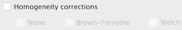

### RadioButtonGroup / RadioButton

Only one RadioButton per group can be selected. The group's `name` is sent to R with the `value` of the selected button.

```qml
RadioButtonGroup
{
    name:  "alternative"
    title: qsTr("Alternative Hypothesis")
    RadioButton { value: "twoSided"; label: qsTr("≠ Test value"); checked: true }
    RadioButton { value: "greater";  label: qsTr("> Test value") }
    RadioButton { value: "less";     label: qsTr("< Test value") }
}
```

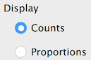

### DropDown

```qml
DropDown
{
    name:   "method"
    label:  qsTr("Method")
    values: [
        { label: qsTr("Pearson"),  value: "pearson"  },
        { label: qsTr("Spearman"), value: "spearman" }
    ]
}
```

Key properties: `source` (populate from a variable list), `addEmptyValue`, `startValue`.

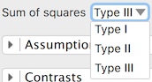

### Numeric fields

| Component | Purpose | Key defaults |
|-----------|---------|--------------|
| `DoubleField` | Decimal input | `min: 0`, `decimals: 3` |
| `IntegerField` | Integer input | `min: 0` |
| `PercentField` | Percentage | `defaultValue: 50` |
| `CIField` | Confidence interval % | `defaultValue: 95` |

```qml
DoubleField  { name: "priorWidth"; label: qsTr("Prior width"); defaultValue: 0.5; max: 2 }
IntegerField { name: "nSamples";   label: qsTr("Samples");     defaultValue: 10000 }
CIField      { name: "ciLevel";    label: qsTr("Confidence interval") }
```

### TextField and FormulaField

`TextField` accepts arbitrary text. `FormulaField` accepts R expressions that evaluate to numbers (e.g., `1/3`, `pi`, `sin(30)`).

```qml
TextField    { name: "labelY"; label: qsTr("Y-axis label"); fieldWidth: 200 }
FormulaField { name: "prior";  label: qsTr("Prior");        defaultValue: "1/3" }
```

### TextArea

Multi-line input; press Ctrl+Enter to apply. Set `textType` for syntax highlighting:

- `JASP.TextTypeLavaan` — lavaan syntax
- `JASP.TextTypeRcode` — R code
- `JASP.TextTypeJAGS` — JAGS model

## Variable specification components

### AvailableVariablesList / AssignedVariablesList

The core drag-and-drop mechanism. Wrap in a `VariablesForm`:

```qml
VariablesForm
{
    AvailableVariablesList { name: "allVariables" }
    AssignedVariablesList
    {
        name:           "dependent"
        label:          qsTr("Dependent Variable")
        singleVariable: true
        allowedColumns: ["scale"]
    }
    AssignedVariablesList
    {
        name:           "fixedFactors"
        label:          qsTr("Fixed Factors")
        allowedColumns: ["nominal", "ordinal"]
    }
}
```

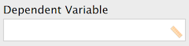

Key `AssignedVariablesList` properties:

| Property | Description |
|----------|-------------|
| `singleVariable` | Only one variable allowed |
| `allowedColumns` | Restrict to `["scale"]`, `["nominal", "ordinal"]`, etc. |
| `listViewType` | `JASP.Interaction` for model terms, `JASP.Layers` for layers |
| `rowComponent` | Add per-variable controls (checkboxes, dropdowns) |

```qml
AssignedVariablesList
{
    name:         "modelTerms"
    label:        qsTr("Model Terms")
    listViewType: JASP.Interaction
    rowComponent: CheckBox { name: "isNuisance"; label: qsTr("Nuisance") }
}
```

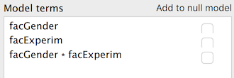

### FactorLevelList

For defining factor names and their levels (e.g., Repeated Measures ANOVA):

```qml
FactorLevelList
{
    name:       "repeatedMeasuresFactors"
    label:      qsTr("Repeated Measures Factors")
    factorName: qsTr("RM Factor")
    minLevels:  2
}
```

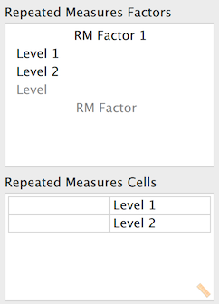

## Complex components

### ComponentsList

Dynamically add/remove sets of options (e.g., multiple models):

```qml
ComponentsList
{
    name:       "models"
    label:      qsTr("Models")
    rowComponent: Group
    {
        TextField { name: "modelName"; label: qsTr("Name") }
        TextArea  { name: "syntax";    textType: JASP.TextTypeLavaan }
    }
}
```

### TabView

Multiple tabs, each containing the same set of controls:

```qml
TabView
{
    name:        "models"
    maximumItems: 9
    newItemName: qsTr("Model 1")
    content: TextArea { name: "syntax"; textType: JASP.TextTypeLavaan }
}
```

### InputListView / TableView

`InputListView` — list of user-specified items with per-item controls.
`TableView` — spreadsheet-like grid input.

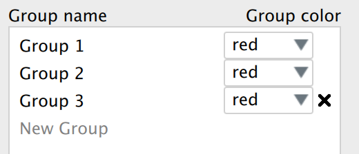

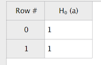

## Grouping components

### Group

Visually groups controls with an optional title:

```qml
Group
{
    title: qsTr("Additional Options")
    CheckBox { name: "meanDifference"; label: qsTr("Mean difference") }
    CheckBox { name: "effectSize";     label: qsTr("Effect size") }
}
```

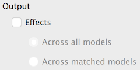

### Section

A collapsible section (accordion):

```qml
Section
{
    title: qsTr("Assumption Checks")
    CheckBox { name: "normalityTest"; label: qsTr("Normality test") }
    CheckBox { name: "equalityOfVariances"; label: qsTr("Equality of variances") }
}
```

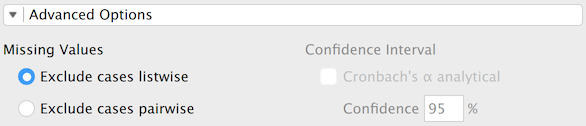

## Layout

Use `Layout.columnSpan` and `Layout.rowSpan` to control how components fill the grid:

```qml
VariablesForm
{
    AvailableVariablesList { name: "allVars" }
    AssignedVariablesList  { name: "vars"; Layout.columnSpan: 2 }
}
```

## The `info` property {#sec-info-property}

Every component accepts an `info` property used to auto-generate help documentation:

```qml
CheckBox
{
    name:  "descriptives"
    label: qsTr("Descriptives")
    info:  qsTr("When checked, displays a table of descriptive statistics.")
}
```

Wrap `info` text in `qsTr()` to make help translatable.

## Complete example

```qml
import QtQuick
import JASP
import JASP.Controls

Form
{
    VariablesForm
    {
        AvailableVariablesList { name: "allVariablesList" }
        AssignedVariablesList  { name: "variables"; label: qsTr("Variables"); allowedColumns: ["scale"] }
        AssignedVariablesList  { name: "groupingVariable"; label: qsTr("Grouping Variable"); singleVariable: true; allowedColumns: ["nominal"] }
    }

    Section
    {
        title: qsTr("Additional Statistics")
        Group
        {
            title: qsTr("Location")
            CheckBox { name: "meanDifference";           label: qsTr("Mean difference") }
            CheckBox { name: "meanDiffConfidenceInterval"; label: qsTr("Confidence interval"); childrenOnSameRow: true
                CIField  { name: "meanDiffCiLevel" }
            }
            CheckBox { name: "effectSize"; label: qsTr("Effect size") }
        }
    }

    Section
    {
        title: qsTr("Assumption Checks")
        CheckBox { name: "normalityTest"; label: qsTr("Normality") }
        CheckBox { name: "equalityOfVariancesTest"; label: qsTr("Equality of variances") }
    }
}
```

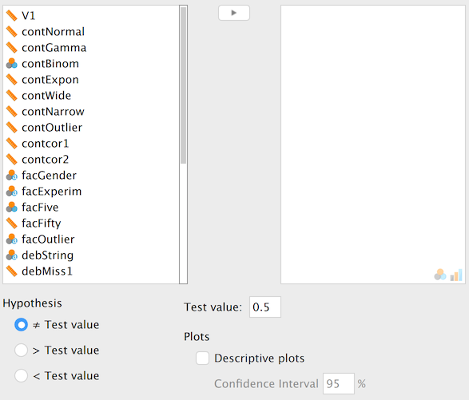
