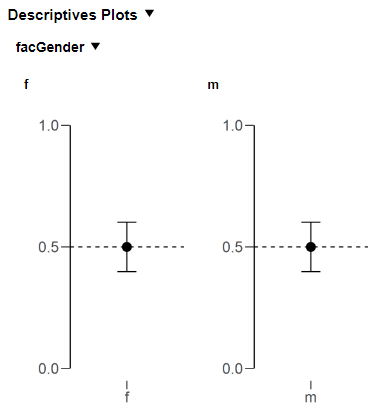

# Writing the R Backend {#sec-r-backend}

## Understanding jaspResults {#sec-jaspresults}

The central concept in JASP's R API is `jaspResults` — a **persistent, named container** that lives for the entire lifetime of an analysis. Think of it as a big box you can throw things into and pull things out of at any point:

- **Tables** (`createJaspTable`)
- **Plots** (`createJaspPlot`)
- **Containers** (`createJaspContainer`) — grouping boxes that hold other tables/plots
- **State** (`createJaspState`) — cached R objects (models, intermediate results)
- **HTML** (`createJaspHtml`) — free-form text output

You store items by assigning them to named slots: `jaspResults[["myTable"]] <- table`. You retrieve them the same way: `jaspResults[["myTable"]]`. If a slot is `NULL`, the item hasn't been created yet.

### Why this matters

In a traditional R script you'd pass individual objects between functions — the model object to the table function, then to the plot function, etc. In JASP, **every function just receives `jaspResults`** and can reach into it for whatever it needs. This eliminates the need to pass around dozens of objects:

```{mermaid}
flowchart TD
    Main["Main function"] -->|"stores table"| JR["jaspResults"]
    Main -->|"stores state"| JR
    TableFn[".fillTable()"] -->|"reads state"| JR
    PlotFn[".fillPlot()"] -->|"reads state"| JR
    TableFn -->|"fills table"| JR
    PlotFn -->|"fills plot"| JR
```

### Automatic caching

Every item in `jaspResults` declares which options it **depends on** (via `$dependOn()`). When the user changes an option in the GUI:

- Items that depend on the changed option are **automatically invalidated** and recreated
- Items that don't depend on it are **kept as-is** — no recomputation

This is why every output function starts with `if (!is.null(jaspResults[["myTable"]])) return()` — if the table already exists and its dependencies haven't changed, skip it entirely.

### Sketch of an analysis

Here is the shape every JASP analysis follows (the full runnable version is in the [Analysis Skeleton](appendix-skeleton.qmd) appendix):

```r
MyAnalysis <- function(jaspResults, dataset, options) {
  ready <- length(options[["variables"]]) > 0          # 1. ready check

  if (ready) {
    .myAnalysisCheckErrors(dataset, options)             # 2. error check
    .myAnalysisComputeResults(jaspResults, dataset, options) # 3. compute & store
  }

  .myAnalysisMainTable(jaspResults, options, ready)      # 4. table
  .myAnalysisPlot(     jaspResults, options, ready)      # 5. plot

  return()
}
```

Notice: **no return values are passed between functions**. `.myAnalysisComputeResults()` stores the model in `jaspResults`; the table and plot functions retrieve it from there. If the user only toggles a plot checkbox, the model and table are still cached — only the plot is recreated.

## The analysis function pattern {#sec-main-function}

Every JASP analysis follows the same structure. The main function name must match the `func` field in `Description.qml` (case-sensitive). It always receives three arguments:

| Argument | Description |
|----------|-------------|
| `jaspResults` | The persistent results container — store all tables, plots, state, and containers here |
| `dataset` | The dataset, preloaded by JASP when `preloadData: true` (the default and recommended setting). `NULL` if `preloadData: false` |
| `options` | Named list of user selections from the QML form |

The main function orchestrates the analysis by calling helper functions. Think of it as a recipe:

1. **Ready check** — can we compute? (are variables assigned?)
2. **Error check** — is the data valid?
3. **Compute** — fit the model, store results in `jaspResults`
4. **Output** — create tables and plots that retrieve results from `jaspResults`

The rest of this chapter walks through each step using a single running example. See the [Analysis Skeleton](appendix-skeleton.qmd) appendix for the complete copy-paste template.

::: {.callout-important}
Always access options with double brackets: `options[["myOption"]]`. Single brackets or `$` allow partial matching which can cause subtle bugs.
:::

::: {.callout-tip}
For a complete copy-paste starting point, see the [Analysis Skeleton](appendix-skeleton.qmd) appendix.
:::

## Step 2: Check if results can be computed

Most analyses need minimum input before computing. Determine this early:

```r
ready <- length(options[["variables"]]) > 0
```

When `ready` is `FALSE`, your output functions should still create and attach tables and plots — they just won't fill in the data yet, so the user sees an empty placeholder with dots. Once the user assigns variables and `ready` becomes `TRUE`, the results are computed and filled in. See the [table example in Step 5](#sec-tables) for how this works in practice: the table is fully configured and attached *before* the `if (!ready) return()` check.

```{mermaid}
flowchart LR
  A(["Start"]) --> Decision{"Input sufficient?"}
  Decision -- yes --> B["Compute & display results"]
  Decision -- "not yet" --> C["Show empty placeholders"]
```

## Step 3: The dataset {#sec-preload-data}

With `preloadData: true` (the default in `Description.qml`), JASP passes the dataset directly to your R function via the `dataset` argument — **you do not need a read-data function.** Columns are automatically converted to the types requested by QML components: if an `AssignedVariablesList` has `allowedColumns: ["scale"]`, those columns arrive in R as numeric.

If you need listwise deletion, do it inline in the main function or a small helper:

```r
dataset <- jaspBase::excludeNaListwise(dataset, unlist(options[["variables"]]))
```

If your analysis needs columns split into separate data frames (e.g., a layout variable vs. analysis variables), subset the preloaded `dataset`:

```r
mainData   <- dataset[, mainVariables]
layoutData <- dataset[, layoutVariables]
```

::: {.callout-warning title="Legacy: readDataSetToEnd() is deprecated"}
Older JASP analyses used a separate function — `readDataSetToEnd()` (or `.readDataSetToEnd()`) — to load data inside the R analysis. This function is **deprecated** and should **not** be used in new code. With `preloadData: true`, the data arrives in the `dataset` argument ready to use, with column types already set by QML. If you encounter `readDataSetToEnd()` in existing code, replace it by enabling `preloadData: true` in `Description.qml` and using the `dataset` argument directly.
:::

### When to disable preloading

For some analyses JASP cannot infer which column names appear in the options (e.g., **JAGS**, **SEM** where variable names are embedded in syntax strings). Disable preloading per-analysis in `Description.qml`:

```qml
Analysis
{
    title:         qsTr("Structural Equation Modeling")
    func:          "SEM"
    preloadData:   false
}
```

When `preloadData: false`, the `dataset` argument is `NULL` and you must read data manually.

### Column encoding

Column names are **encoded** (e.g., `JaspColumn_.1._Encoded`) to handle special characters. The values in `options` are also encoded, so you can subset directly:

```r
dataset[, options[["variables"]]]
```

When displaying column names to users (e.g., as axis tick labels in plots), decode them:

```r
jaspBase::decodeColNames("JaspColumn_.1._Encoded")  # returns original name
```

::: {.callout-tip}
Only decode at the last moment before display. Keep names encoded internally for reliable matching.
:::

## Step 4: Check for errors {#sec-error-checking}

Even with sufficient input, data may contain problems. Use `.hasErrors()` for common checks:

```r
.hasErrors(dataset,
  type                 = c("observations", "variance", "infinity"),
  all.target           = options[["variables"]],
  observations.amount  = "< 3",
  exitAnalysisIfErrors = TRUE
)
```

### Available error checks

| Check | What it does | Key argument |
|-------|-------------|--------------|
| `infinity` | Infinite values in variables | `target`, `grouping` |
| `negativeValues` | Negative values | `target` |
| `missingValues` | Missing values (NA) | `target` |
| `observations` | Count of observations vs threshold | `amount` (e.g., `"< 2"`) |
| `variance` | Zero or specific variance | `equalTo` (default: `0`) |
| `factorLevels` | Number of factor levels | `amount` (e.g., `"< 2"`) |
| `limits` | Value within min/max bounds | `min`, `max` |

Prefix arguments with the check name: `observations.amount`, `variance.target`, etc. Use `all.` prefix to apply to all checks: `all.target = options[["variables"]]`.

## Step 5: Create output {#sec-create-output}

### Tables {#sec-tables}

Tables are the most common output. The lifecycle:

1. **Check cache** — if `jaspResults[["myTable"]]` exists, skip creation
2. **Create** — `createJaspTable(title = "My Results")`
3. **Set dependencies** — `$dependOn(c("opt1", "opt2"))`
4. **Define columns** — `$addColumnInfo(name, title, type)`
5. **Attach to output** — `jaspResults[["myTable"]] <- table`
6. **Fill with data** — `$addRows(list(...))`

Continuing our running example — the table retrieves the model from `jaspResults`:

```r
.myAnalysisMainTable <- function(jaspResults, options, ready) {
  # Skip if already cached
  if (!is.null(jaspResults[["mainTable"]])) return()

  # Create and configure
  table <- createJaspTable(title = gettext("Results"))
  table$dependOn(c("variables", "dependent"))

  # Define columns
  table$addColumnInfo(name = "term",     title = gettext("Term"),       type = "string")
  table$addColumnInfo(name = "estimate", title = gettext("Estimate"),   type = "number")
  table$addColumnInfo(name = "se",       title = gettext("Std. Error"), type = "number")
  table$addColumnInfo(name = "p",        title = "p",                   type = "pvalue")

  # Attach to jaspResults — shows an empty placeholder immediately
  jaspResults[["mainTable"]] <- table

  if (!ready) return()

  # Retrieve the cached model and fill
  results <- jaspResults[["myAnalysisState"]]$object
  coefTab <- summary(results$model)$coefficients

  for (i in seq_len(nrow(coefTab))) {
    table$addRows(list(
      term     = rownames(coefTab)[i],
      estimate = coefTab[i, "Estimate"],
      se       = coefTab[i, "Std. Error"],
      p        = coefTab[i, "Pr(>|t|)"]
    ))
  }
}
```

#### Column types

| Type | Description | Format options |
|------|-------------|----------------|
| `string` | Text | — |
| `number` | Decimal number | `sf:4`, `dp:3`, `pc` (percentage) |
| `integer` | Whole number | — |
| `pvalue` | p-value with smart formatting | — |

#### Footnotes

```r
table$addFootnote(message = gettext("Some note about the table."))
# Target specific cells:
table$addFootnote(message = "...", colNames = "p", rowNames = "var1")
```

#### Reporting errors on tables

When a computation can fail, wrap it in `try()` and use `$setError()` to display a meaningful message on the table (or container) instead of crashing the analysis:

```r
model <- try(lm(y ~ x, data = dataset))
if (isTryError(model)) {
  container$setError(.extractErrorMessage(model))
  return()
}
```

For known failure modes you can match the error message and provide a more helpful, translated explanation:

```r
if (isTryError(model)) {
  errorMsg <- .extractErrorMessage(model)

  if (errorMsg == "singular fit encountered") {
    container$setError(gettext(
      "Singular fit encountered; one or more predictor variables are a linear combination of other predictor variables"
    ))
  } else if (errorMsg == "residual sum of squares is 0 (within rounding error)") {
    container$setError(gettext(
      "Residual sum of squares is 0; this might be due to extremely low variance of your dependent variable"
    ))
  } else {
    container$setError(errorMsg)
  }
  return()
}
```

Note: `$setError()` works on tables, plots, and containers. Setting it on a container marks all its contents as errored (see @sec-containers).

### Plots {#sec-plots}

Plots follow the same pattern. JASP only supports `ggplot2`.

```r
.myAnalysisPlot <- function(jaspResults, options, ready) {
  if (!options[["residualPlot"]]) return()  # only if user enabled the checkbox
  if (!is.null(jaspResults[["residualPlot"]])) return()

  plot <- createJaspPlot(title = gettext("Residuals vs. Fitted"),
                         width = 480, height = 320)
  plot$dependOn(c("variables", "dependent", "residualPlot"))
  jaspResults[["residualPlot"]] <- plot

  if (!ready) return()

  # Retrieve cached model
  results  <- jaspResults[["myAnalysisState"]]$object
  plotData <- data.frame(
    fitted    = fitted(results$model),
    residuals = residuals(results$model)
  )

  plot$plotObject <- ggplot2::ggplot(plotData,
      ggplot2::aes(x = .data[["fitted"]], y = .data[["residuals"]])) +
    ggplot2::geom_point() +
    ggplot2::geom_hline(yintercept = 0, linetype = "dashed") +
    ggplot2::labs(x = gettext("Fitted values"), y = gettext("Residuals"))
}
```

### Text (HTML) output

```r
htmlOutput <- createJaspHtml(text = gettextf("Variable %s was excluded.", varName))
htmlOutput$dependOn("variables")
jaspResults[["myText"]] <- htmlOutput
```

HTML tags (`<b>`, `<i>`) can be used for formatting.

## Containers: grouping output elements {#sec-containers}

Containers group related tables and plots visually and functionally. The key benefit: **dependencies set on a container are inherited by all its contents**. When a depended-on option changes, JASP automatically empties the entire container (sets it to `NULL`), so all its tables, plots, and state are recreated together.

### Container as a caching gate

A common pattern is to put the model state *inside* a container, then check whether the container is `NULL` to decide if results need to be (re)computed:

```r
MyAnalysis <- function(jaspResults, dataset, options) {
  ready <- length(options[["variables"]]) > 0

  if (ready) {
    .myCheckErrors(dataset, options)
    .myComputeResults(jaspResults, dataset, options)
  }

  .myMainTable(jaspResults, options, ready)
  .myPlot(     jaspResults, options, ready)

  return()
}

.myComputeResults <- function(jaspResults, dataset, options) {
  # If the container still exists, all results inside it are still valid
  # — nothing to do.
  # If it is NULL, either:
  #   (a) this is the first time the analysis runs, or
  #   (b) the user changed an option the container depends on,
  #       so JASP emptied it and we must recompute.
  if (!is.null(jaspResults[["resultsContainer"]]))
    return()

  container <- createJaspContainer(title = gettext("Results"))
  container$dependOn(c("dependent", "variables", "method"))
  jaspResults[["resultsContainer"]] <- container

  # Expensive computation
  model   <- lm(as.formula(paste(options[["dependent"]], "~ .")),
                 data = dataset)
  results <- list(model = model)

  # Store inside the container — lives and dies with it
  container[["state"]] <- createJaspState(results)
}
```

Because the state lives *inside* the container, it is automatically discarded when the container is invalidated — no separate `$dependOn()` needed on the state itself.

The output functions then retrieve the model from the container:

```r
.myMainTable <- function(jaspResults, options, ready) {
  if (!is.null(jaspResults[["resultsContainer"]][["mainTable"]])) return()

  table <- createJaspTable(title = gettext("Coefficients"))
  # No need to repeat dependOn — inherited from the container
  jaspResults[["resultsContainer"]][["mainTable"]] <- table

  if (!ready) return()

  results <- jaspResults[["resultsContainer"]][["state"]]$object
  coefTab <- summary(results$model)$coefficients

  for (i in seq_len(nrow(coefTab))) {
    table$addRows(list(
      term     = rownames(coefTab)[i],
      estimate = coefTab[i, "Estimate"],
      p        = coefTab[i, "Pr(>|t|)"]
    ))
  }
}
```

::: {.callout-tip}
**When to use a container vs. bare `jaspResults` slots**: if several outputs share the same set of dependencies and should all recompute together, wrap them in a container and set `$dependOn()` once. If an output has unique dependencies (e.g., a plot toggled by its own checkbox), attach it directly to `jaspResults` with its own `$dependOn()`.
:::

### Per-value dependencies

For loops over variables, use `optionContainsValue` so that adding or removing one variable only invalidates that specific element:

```r
container <- createJaspContainer(title = gettext("Descriptive Plots"))
container$dependOn(c("variables", "plotDescriptives"))
jaspResults[["descContainer"]] <- container

for (variable in options[["variables"]]) {
  if (!is.null(container[[variable]])) next  # skip if cached

  plot <- createJaspPlot(title = variable, width = 480, height = 320)
  plot$dependOn(optionContainsValue = list(variables = variable))
  container[[variable]] <- plot

  # ... fill plot ...
}
```



### Container errors

Setting an error on a container propagates to all its contents:

```r
container$setError(gettext("Something went wrong."))
if (container$getError()) return()
```

## State: caching computed results {#sec-state}

When multiple output elements (tables, plots, assumption checks) share the same expensive computation, you don't want to run it separately for each. Use `createJaspState()` to **store any R object** in `jaspResults` and retrieve it later.

Continuing our running example — here is the compute function. It stores the model in `jaspResults` and returns nothing:

```r
.myAnalysisComputeResults <- function(jaspResults, dataset, options) {
  # Already cached? Nothing to do.
  if (!is.null(jaspResults[["myAnalysisState"]]))
    return()

  # Expensive computation (e.g., fitting a model)
  results <- list(
    model = lm(as.formula(paste(options[["dependent"]], "~ .")),
               data = dataset)
  )

  # Store in jaspResults — invalidated automatically when dependencies change
  state <- createJaspState(results)
  state$dependOn(c("dependent", "variables"))
  jaspResults[["myAnalysisState"]] <- state
}
```

The main function calls `.myAnalysisComputeResults()` once. The table and plot functions (shown above in @sec-tables and @sec-plots) both retrieve the cached results via `jaspResults[["myAnalysisState"]]$object`. On the first run the model is fitted and stored; on subsequent runs where the dependencies haven't changed, the function returns immediately and the table and plot reuse the cached model.

### What can you store in state?

Anything — model objects, matrices, lists of results, data frames. The only constraint is that the object must be serialisable (which almost everything in R is). Common patterns:

| What to cache | Why |
|--------------|-----|
| Fitted model (`lm`, `aov`, etc.) | Avoids refitting when the user toggles a plot checkbox |
| Correlation/test-statistic matrix | Shared between main table, assumption table, and plot |
| Bootstrap samples | Expensive to generate; reused for CIs and plots |
| Preprocessed dataset | When cleaning/transforming is slow |
