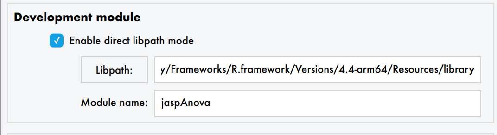
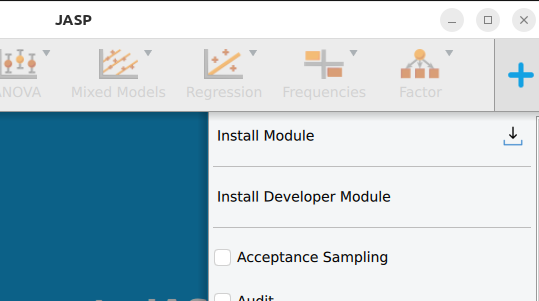
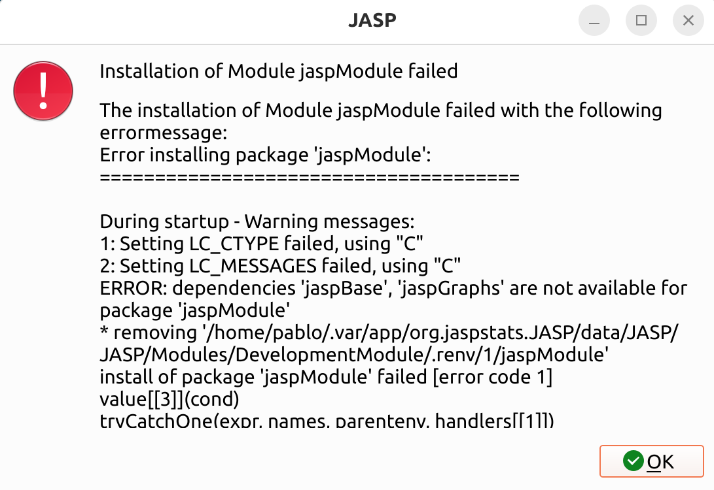

# Setting Up Your Environment {#sec-setup}

## Install JASP (nightly build)

You need a recent version of JASP to develop modules. Nightly builds include the latest features.

::: {.panel-tabset}

### Windows & macOS

Download the latest [nightly build](http://static.jasp-stats.org/Nightlies/) for your platform.

### Linux

```bash
# 1. Install flatpak if needed: https://flatpak.org/setup/
# 2. Add the beta repository
flatpak remote-add --if-not-exists flathub-beta https://flathub.org/beta-repo/flathub-beta.flatpakrepo

# 3. Install JASP beta
flatpak install flathub-beta org.jaspstats.JASP

# 4. Launch in development mode
flatpak run --branch=beta --devel org.jaspstats.JASP
```

::: {.callout-warning}
JASP remembers the branch it was launched from.
To switch back to stable: `flatpak run --branch=stable org.jaspstats.JASP`
:::

If you see `runtime/org.kde.Sdk/x86_64/6.7 not installed`, fix it with:

```bash
flatpak install org.kde.Sdk   # choose version 6.7
```

:::

## Install and configure Git {#sec-git-setup}

[Git](https://git-scm.com/) is a version control system that tracks changes to your code over time. It lets you undo mistakes, work on different features in parallel (via *branches*), and collaborate with others through platforms like [GitHub](https://github.com). All JASP modules are hosted on GitHub, so you'll need Git throughout your development workflow.

### Install Git

::: {.panel-tabset}

#### macOS

Git comes with the Xcode Command Line Tools. Open a terminal and run:

```bash
git --version
```

If Git isn't installed, macOS will prompt you to install the tools. Alternatively, install via [Homebrew](https://brew.sh/): `brew install git`.

#### Windows

Download and install from [git-scm.com/downloads](https://git-scm.com/downloads/win). The default settings are fine. This also installs **Git Bash**, a terminal you can use for Git commands.

#### Linux

```bash
# Debian/Ubuntu
sudo apt install git

# Fedora
sudo dnf install git
```

:::

### Configure your identity

Git tags every commit with your name and email. Set these once:

```bash
git config --global user.name "Your Name"
git config --global user.email "you@example.org"
```

### Create a GitHub account

If you don't have one yet, sign up at [github.com](https://github.com). JASP modules live under the [jasp-stats](https://github.com/jasp-stats) organisation.

### Key Git concepts

You don't need to be a Git expert to develop JASP modules, but a few concepts come up constantly:

| Concept | What it means |
|---------|--------------|
| **Repository (repo)** | A project folder tracked by Git |
| **Clone** | Download a copy of a remote repository to your computer |
| **Fork** | Create your own copy of someone else's repository on GitHub |
| **Commit** | Save a snapshot of your changes |
| **Branch** | A parallel line of development (e.g., `feature/my-analysis`) |
| **Push / Pull** | Upload your commits to GitHub / download others' commits |
| **Pull request (PR)** | Ask the maintainers to merge your branch into the main project |

### Learning resources

- [Git User Manual](https://git-scm.com/docs/user-manual.html) — the official comprehensive reference
- [Pro Git book](https://git-scm.com/book/en/v2) — free online book, excellent for beginners and advanced users
- [GitHub Skills](https://skills.github.com/) — interactive tutorials for learning Git with GitHub
- [Oh My Git!](https://ohmygit.org/) — a game to learn Git visually

For the JASP-specific Git workflow (forking, branching, pull requests), see the [Git Workflow](git-workflow.qmd) chapter. That chapter builds on the basics covered here and explains the day-to-day workflow you'll use when contributing to JASP modules. The [Publishing Your Module](publishing.qmd) chapter covers how to submit your module to the JASP Module Library.

## Fork and clone the module template

1. Go to [jaspModuleTemplate](https://github.com/jasp-stats/jaspModuleTemplate) and click **Fork**.
2. Clone your fork:

```bash
git clone https://github.com/<your-username>/jaspModuleTemplate.git
cd jaspModuleTemplate
```

Alternatively, fork an existing module from [jasp-stats](https://github.com/jasp-stats).

## Package Management with renv {#sec-renv}

JASP modules use [renv](https://rstudio.github.io/renv/) to lock package versions. This ensures that your module builds reproducibly and that collaborators (and CI) use the exact same dependency versions.

Every module repository should contain a `renv.lock` file. When you start working on a module, bootstrap the renv environment with this script:

```r
# Set your GitHub PAT to avoid rate limits during package installation
Sys.setenv(GITHUB_PAT = "<your PAT>")

# Activate the renv project (or confirm it's already active)
if (is.null(renv::project())) {
  message("This isn't an active renv project.")
  renv::activate()
} else {
  message("We're in an active renv project.")
}

# Install all locked dependencies
message("Restoring/synchronizing the project library.")
renv::restore()

# Install the module itself into the renv library
message("Installing the package.")
renv::install(".")

# Print the library path — you'll need this for JASP developer mode
message("R libPath for developer mode:\n", .libPaths()[1])
```

The last line prints the **library path** for your newly installed module. Copy this path — you will paste it into JASP's developer mode settings (see [below](#sec-dev-mode)).

::: {.callout-tip}
When you add or update a dependency, run `renv::snapshot()` to update the lockfile and commit it.
:::

## Install your module as an R package

With renv active, the simplest way is:

```r
renv::install(".")
```

Alternatively, from the terminal:

```bash
R CMD INSTALL . --preclean --no-multiarch --with-keep.source
```

Note the library path where the module is installed — you'll need it for developer mode. Run `.libPaths()[1]` in R to see it.

## Configure JASP for development {#sec-dev-mode}

### Recommended: renv mode

1. Open JASP
2. Menu (☰) → **Preferences** → **Advanced**
3. Check **Developer mode**
4. Check **Enable renv mode**
5. Set the **libpath** where you installed the module
6. Enter the **module name** (as listed in `DESCRIPTION`)



7. Go back to the main JASP window
8. Click the **+** icon (top-right) → **Install Developer Module**



## GitHub Personal Access Token {#sec-pat}

If module installation fails with rate-limiting errors:



Create a [GitHub Personal Access Token](https://docs.github.com/en/authentication/keeping-your-account-and-data-secure/managing-your-personal-access-tokens#creating-a-fine-grained-personal-access-token) (no special permissions needed — it just identifies you as a legitimate user).

In JASP: **Preferences → Advanced** → uncheck **Use default PAT for Github** → paste your token → press Enter/Tab.

## The development cycle {#sec-dev-cycle}

```{mermaid}
graph LR
  A[Edit R/QML files] --> B[Recompile module]
  B --> C[Refresh in JASP]
  C --> D[Test changes]
  D --> A
```

1. **Edit** your R and/or QML files in your editor of choice
2. **Recompile**: `R CMD INSTALL . --preclean --no-multiarch --with-keep.source`
3. **Refresh**: in JASP, click **+** → find your module → click the blue refresh button (🔄)

With renv mode, you must recompile to see changes. Without renv mode (deprecated), some changes are reflected immediately but the install process is more fragile.

::: {.callout-tip}
Start with the QML interface before writing the R analysis. This lets you iterate on the UI quickly and see option names before writing the backend code.
:::
